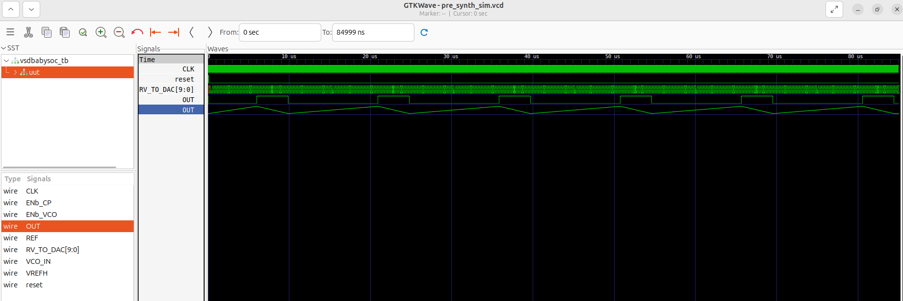
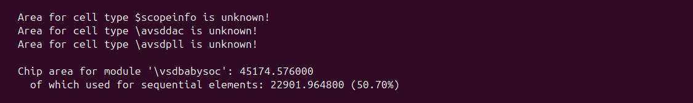
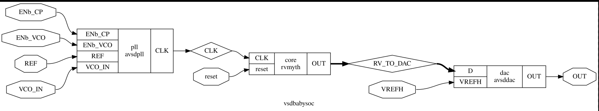
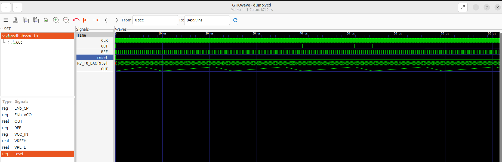

# VSDBabySoC – RTL to Gate-Level Synthesis Flow

## 📘 Overview
The **VSDBabySoC** project demonstrates a complete **digital design flow**, starting from RTL modeling, through synthesis, and ending with **gate-level simulation (GLS)**.  

BabySoC integrates three essential building blocks:
- 🖥 **rvmyth** → lightweight RISC-V CPU core  
- 🎚 **avsddac** → Digital-to-Analog Converter (DAC)  
- ⏱ **avsdpll** → Phase-Locked Loop (PLL)  

Together, these components form a minimal SoC that can be **simulated, synthesized, and validated** down to the gate level using an open-source toolchain.  

---

## 🎯 Project Goals
- Develop intuition in **SoC architecture and flow**  
- Practice **RTL modeling and verification** with BabySoC  
- Perform **logic synthesis** using SkyWater 130nm PDK  
- Verify **functional equivalence** between RTL and GLS  

---

## 🛠 Toolchain Overview
This flow uses a **fully open-source stack**:
- **Sandpiper** → Translates TL-Verilog to Verilog for rvmyth  
- **Icarus Verilog** → RTL & GLS simulation  
- **Yosys** → Logic synthesis with Sky130 library  
- **GTKWave** → Waveform visualization  


👉 To generate the CPU core Verilog:
```bash
pip3 install pyyaml click sandpiper-saas
sandpiper-saas -i ./src/module/*.tlv -o rvmyth.v --bestsv --noline -p verilog --outdir ./src/module/
```
## ⚙️ Flow Walkthrough

## 1️⃣ Pre-Synthesis RTL Simulation
```bash
iverilog -o output/pre_synth_sim/pre_synth_sim.out -DPRE_SYNTH_SIM src/module/testbench.v -I src/include -I src/module
cd output/pre_synth_sim
./pre_synth_sim.out
gtkwave pre_synth_sim.vcd
```

✅ Confirms DAC writes and PLL locking at RTL level.


## 2️⃣ Synthesis with Yosys

Analog IPs (avsddac, avsdpll) are modeled as stubs (black boxes) during synthesis.

Example:
```verilog
module avsddac (
   output OUT,
   input [9:0] D,
   input VREFH,
   input VREFL
);
// Black-box definition
endmodule
```

Synthesis flow (Yosys):
```bash
read_liberty -lib src/lib/sky130_fd_sc_hd__tt_025C_1v80.lib
read_liberty -lib src/lib/avsddac.lib
read_liberty -lib src/lib/avsdpll.lib
read_verilog src/module/vsdbabysoc.v
read_verilog -I src/include src/module/rvmyth.v
read_verilog -I src/include src/module/clk_gate.v
read_verilog src/module/avsddac_stub.v
read_verilog src/module/avsdpll_stub.v
synth -top vsdbabysoc
dfflibmap -liberty src/lib/sky130_fd_sc_hd__tt_025C_1v80.lib
opt
abc -liberty src/lib/sky130_fd_sc_hd__tt_025C_1v80.lib
flatten
setundef -zero
clean -purge
rename -enumerate
write_verilog -noattr VSDBabySoC/src/module/vsdbabysoc_netlist.v
stat -liberty src/lib/sky130_fd_sc_hd__tt_025C_1v80.lib
show vsdbabysoc
```

✅ Produces gate-level netlist and synthesis statistics.


✔ Produces gate-level netlist


## 3️⃣ Gate-Level Simulation (GLS)

Once synthesized, simulate the netlist to validate RTL equivalence:
``` bash
iverilog -DFUNCTIONAL -DUNIT_DELAY=#1 -I src/gls_model \
  -o output/post_synth_sim/post_synth_sim.out \
  src/module/testbench.rvmyth.post-routing.v src/module/testbench.v \
  src/gls_model/primitives.v src/gls_model/sky130_fd_sc_hd.v \
  output/synthesized/vsdbabysoc.synth.v src/module/avsdpll.v src/module/avsddac.v
```
```bash
cd output/post_synth_sim
./post_synth_sim.out
gtkwave dump.vcd
```

✅ GLS waveforms line up with RTL — functional equivalence achieved!


## 📊 Key Outcomes

- RTL simulation passed

- Netlist successfully synthesized

- GLS waveforms identical to RTL

## 🚀 Conclusion

The VSD BabySoC project provides a hands-on demonstration of a full-chip digital flow using open-source tools. By validating RTL and GLS consistency, the design is ready to move forward into physical design.
